##Apple Push Notification Services
APNS 全名為 Apple Push Notification Service，也就是大家常說的 Push Notification 或者是 Server Push 技術，簡單說就是主動由 Server 發送訊息到 Client 的方法，而通常這樣的技術都會實作穿越防火牆的能力。在 iOS 所提供的 APNS 的架構中，包含了以下幾種角色：
<ul>
<li>Device - 就是你的行動上網裝置 (MID)</li>
<li>APNS - Apple 提供連線服務的伺服器 (Gateway)</li>
<li>Provider - 需要自行實作的訊息發送者</li>
</ul>
接收 Notification 的單位稱為 Device，發送 Notification 的單位稱為 Provider。Provider 與 Device 這兩個單位皆需要與 APNS 進行溝通，必須認證連線後才能正確工作。Device 就是我們的行動裝置 (iPhone/iPad)，當有網路的時候 iOS 就動裝置會自動連上 APNS，並且登入自己的裝置，這時 Device 就準備好可以接收訊息了，其架構圖可以參考下圖：
</br></br>
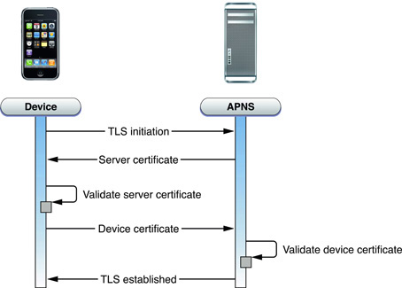

而負責發送訊息的 Provider 就需要自行透過憑證建立連線來發送訊息，連線時使用 SSL TLS 機制進行認證與加密，下圖為 Apple 官方提供的驗證架構圖：
</br></br>


接下來則會開始進行Push Service需要的連線憑證 SSL Push Certificate申請教學。

##SSL Push Certificate申請教學

1. 首先進入到ios developer center,點選Certificates, Identifiers & Profiles => Identifiers
</br></br>
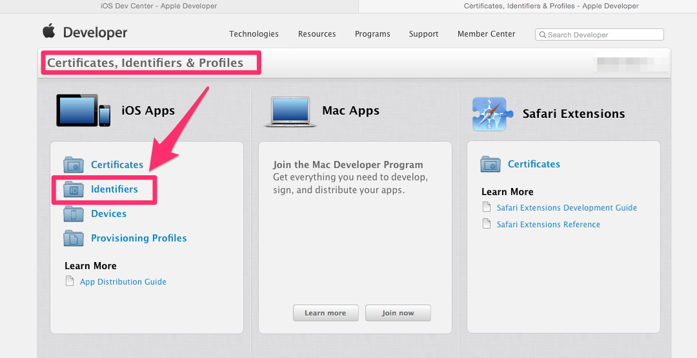

2. 選擇App IDs,並點選建立新的App
</br></br>
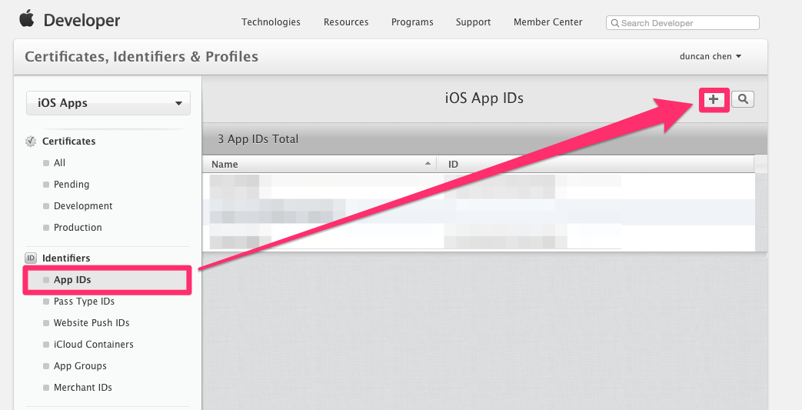

3. 輸入App名稱,並在Explicit App ID輸入Bundle ID,最後在App Services要記得勾選Push Notifications
</br></br>
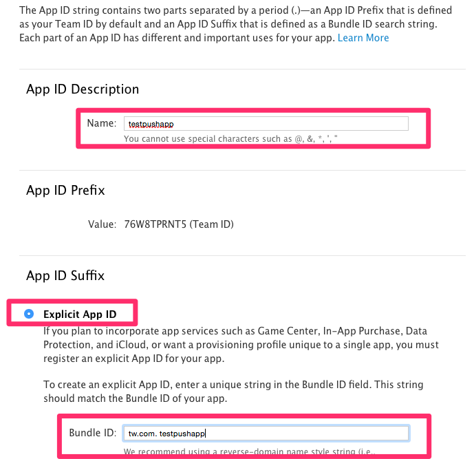
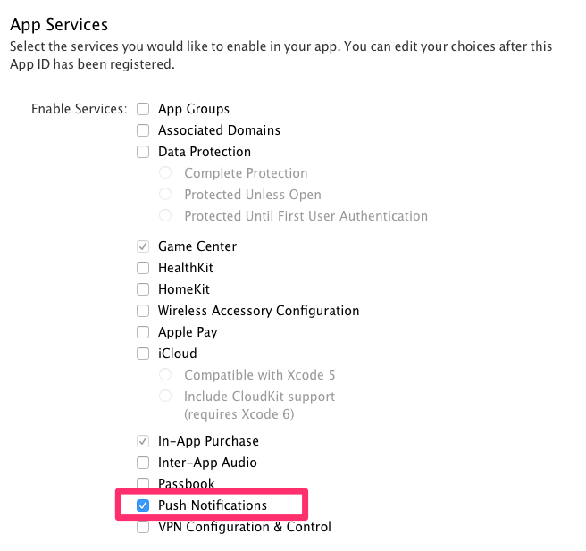

4. 新增完系統會出現確認畫面,可以看到Push Notifications的狀態為Configurable,這時候直接按下submit按鈕送出後,App就會新增完畢
</br></br>
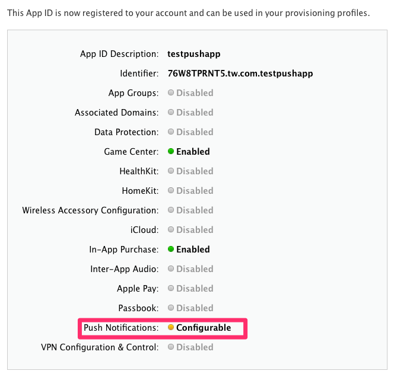

5. 接下來要進行Push Notifications的設定,並建立service所需要的SSL憑證,先回到App IDs頁面並點選剛剛新增的App,並點選按鈕,將畫面拉到Push Notifications的畫面
</br></br>


6. 建立開發用的SSL憑證,在Development SSL Certificate項目中點選按鈕
</br></br>
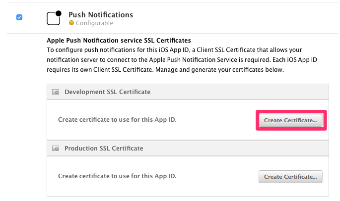

7. 系統會提示需要建立CSR file,直接點選按鈕,系統會需要上傳certSigningRequest file,至於該檔案怎麼製作請自行google,點選按鈕上傳檔案,在按下按鈕後,憑證即可製作完畢
</br></br>


8. 系統產生憑證後,點選按鈕下載到電腦後,,直接點選兩下則會將憑證匯入到『鑰匙圈存取』,可以在『我的憑證』選項找到剛剛匯入的憑證,另外在系統在點選按鈕會到iOS Certificates頁面,可以畫面看到剛剛新增的App憑證
</br></br>
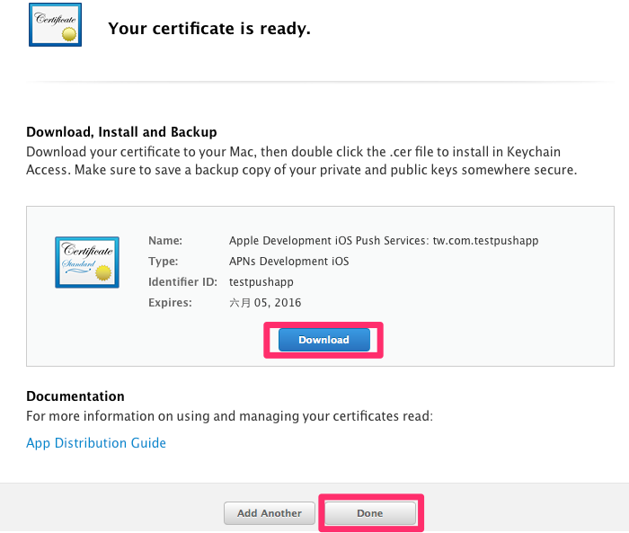
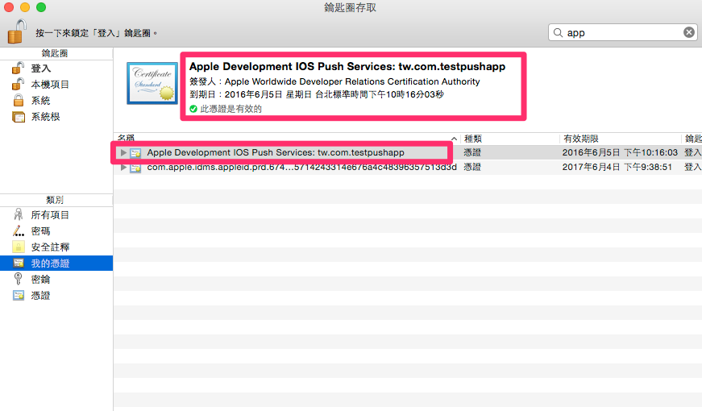

9. 將Apple Development IOS Push Services憑證與金要匯出成.p12檔,再匯出的時候需要輸入密碼與系統登入密碼
</br></br>
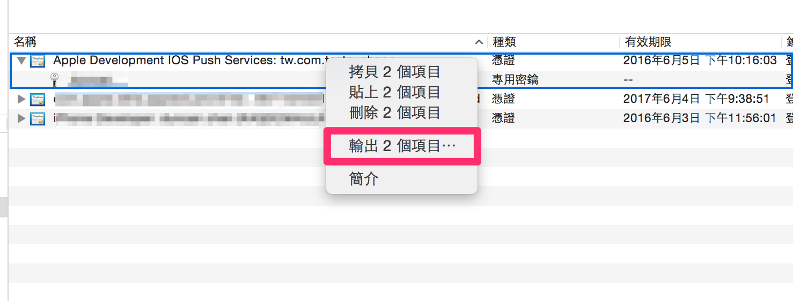
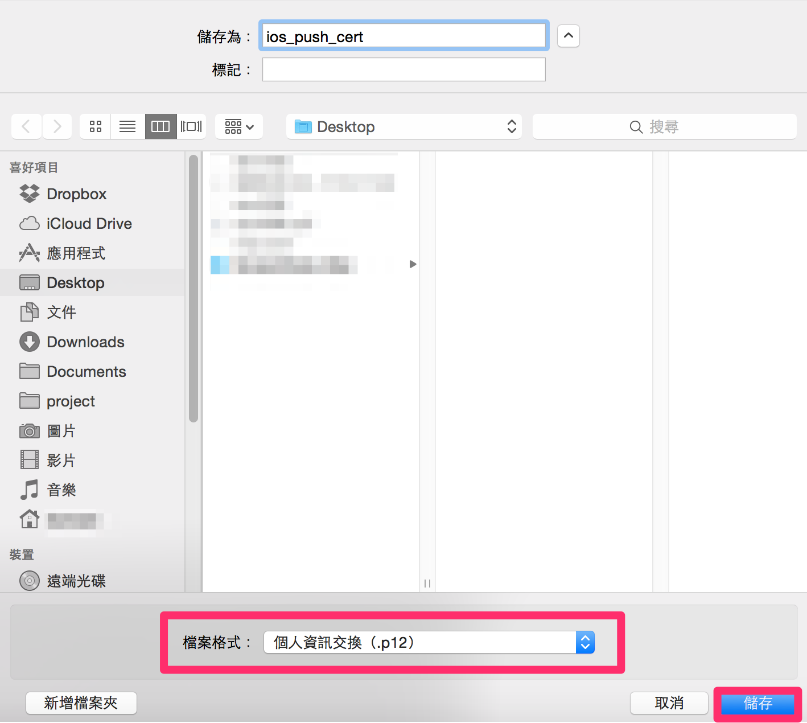

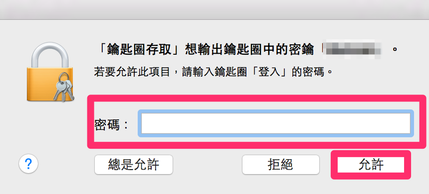

10. 現在要將匯出來的.p12檔案利用openssl去轉換成pem檔,最後將push_develop_cert.pem與pushkey.pem合併為ck.pem,這個檔案就是要放置推送主機所需要的檔案,首先開啟終端機輸入以下指令
	1. cd Desktop/
	2. openssl pkcs12 -clcerts -nokeys -out push_develop_cert.pem -in ios_push_cert.p12
	3. openssl pkcs12 -nocerts -out push_develop_key.pem -in ios_push_cert.p12
	4. openssl rsa -in push_develop_key.pem -out pushkey.pem
	5. cat push_develop_cert.pem pushkey.pem > ck.pem
<br><br>
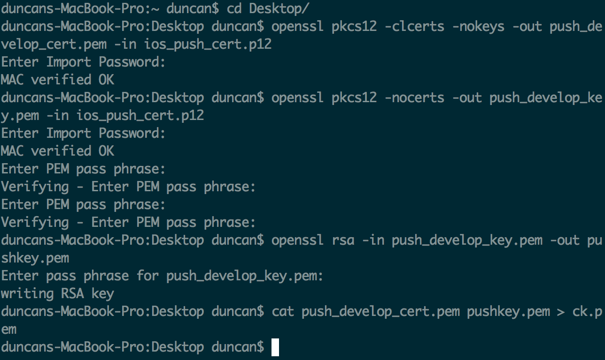

11.現在來測試看看剛剛所產製出來的pem檔案是否可以正常使用SSL憑證連線到測試sandbox push server,假如測試結果成功會出現一堆連線訊息,就可以直接離開終端機
```
openssl s_client -connect gateway.sandbox.push.apple.com:2195 -cert push_develop_cert.pem -key pushkey.pem
```
<br><br>
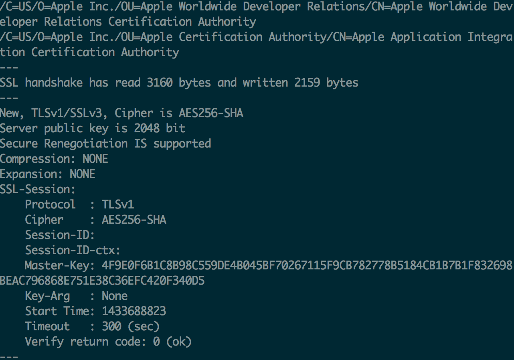

##App測試推播功能

測試App所需要開發環境與套件如下：
	
1. ionic
2. cordova
3. ngCordova
4. ngCordova plugin PushPlugin
5. org.apache.cordova.media
6. org.apache.cordova.dialogs

App開發測試步驟

1. 先利用ionic建立專案,專案名稱要與申請憑證app名稱一樣
	
	```ionic start testpushapp```
	

2. 安裝ngCordova

	```bower install ngCordova```
	
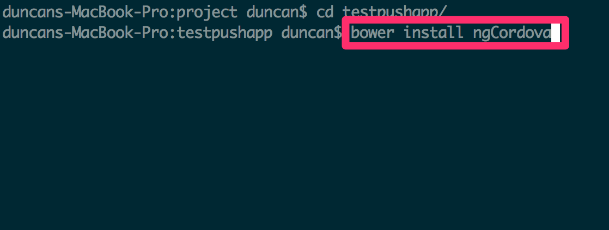

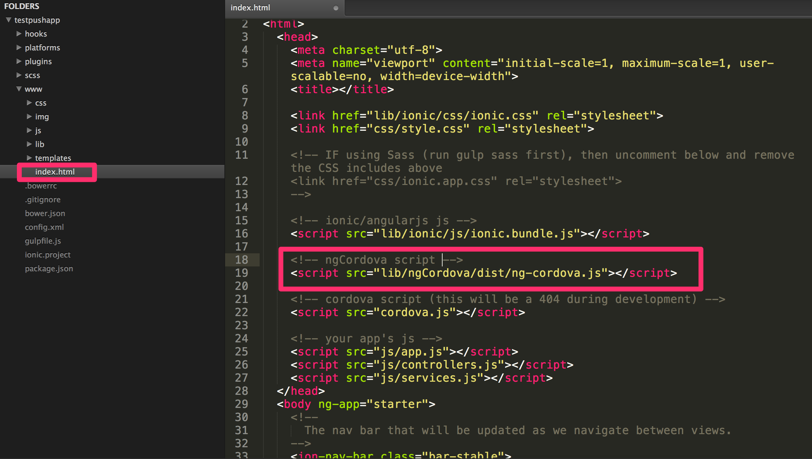
3. 安裝推播訊息套件

```ionic plugin add https://github.com/phonegap-build/PushPlugin.git```
	


```ionic plugin add org.apache.cordova.media```

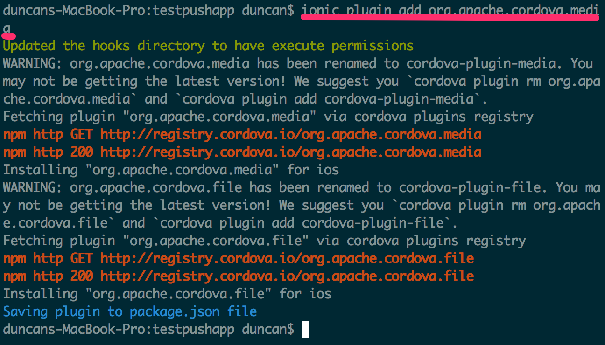

```ionic plugin add org.apache.cordova.dialogs ```


4. 在controllers.js新增註冊與接收訊息功能
[程式範例](https://gist.github.com/diablofong/90703eb599d0a44cc955)<br>
5. 修改config.xml的widget id,注意該id必須與App的Bundle ID一樣

6. 利用測試程式進行推播訊息測試
[發送訊息測試程式](https://gist.github.com/diablofong/9f5148a0be9e4fcd7667)<br>

##測試結果
<a href="http://www.youtube.com/watch?feature=player_embedded&v=G4najc0eC24
" target="_blank"></a>

##範例程式
請參考Push Notification Example資料夾

